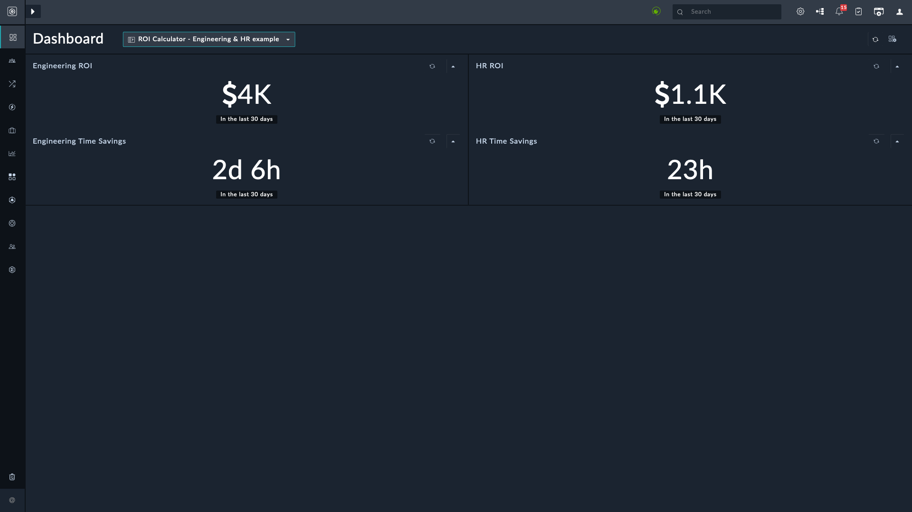

| [Home](https://github.com/fortinet-fortisoar/solution-pack-roi-calculator-usage/blob/release/1.0.0/README.md) |
|--------------------------------------------|

# Usage
- Navigate to the newly created dashboard **ROI Calculator - Engineering & HR example**. This dashboard will show $0 cost savings for both ENG and HR roles.

- Navigate to the newly added playbooks in the **02 - Use Case - ROI Calculator Usage** playbook collection.

- Run the playbooks in the included collection several times each using the playbook execute button inside the playbook designer. 
Each execution of the **Example ENG playbook** adds 30 minutes to the ENG job code, as defined by the roi-eng-30 tag. Each execution of the **Example HR playbook** adds 20 minutes, as defined by the roi-hr-20 tag.

- Return to the dashboard and refresh. The cost savings should populate depending on how many times you run the playbooks.

- The dashboards are configured to display the ROI cost savings at $75/hr for the ENG job code and $50/hr for the HR job code.

- Below is an example after ~100 executions of the ENG playbook and ~50 executions of the HR playbook.

    

## Customize

Refer to the [widget ROI](https://github.com/fortinet-fortisoar/widget-roi-calculator/blob/release/1.0.0/README.md) documentation to implement your own use case:

- Change the job codes to match your needs. Job code can be your department's identifier, for example, Engineering department's code can be `ENG` and Human Resources department's code can be `HR`
- Add the `ROI` and `ROI_<JobCode>_<minutes>` tags to your playbooks to estimate how long it takes the JobCode to complete the same task manually (in minutes). For example, the tag `ROI_ENG_20` represents 20 minutes of engineering time
- Change it up by adding multiple tags to a playbook - e.g. `ROI`, `ROI_HR_15` to represent 15 minutes of HR time
- Change up the dashboard by adding multiple job codes to a single ROI widget configuration to calculate the total of all listed job codes
